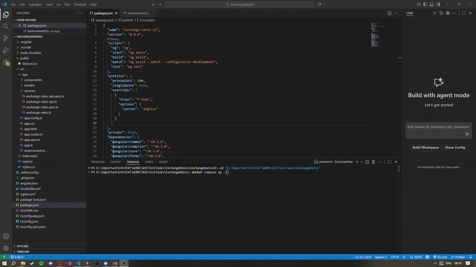

# 💱 Exchange Rate Portal

## 📋 1. Project Overview
A web application for tracking and analyzing currency exchange rates from the Bank of Lithuania. 
The portal provides real-time exchange rates, historical data visualization, and currency conversion capabilities. 
Rates are automatically synchronized daily from the LB.lt web service, with initial data populated for the last 90 days.

### 🚀 Key functionality:
- Display current exchange rates from Bank of Lithuania
- Show historical exchange rate data with charts/tables
- Currency calculator for amount conversion
- Automated daily rate updates via Quartz scheduler

### 🎥 Demo

#### 🔧 Infrastructure Setup
  
*Docker Compose startup and Swagger API documentation*  

#### 🌟 Application Features  
  
*Currency calculator, historical rates, and multi-region support (Lithuania/EU)*  

#### 🛡️ Error Handling  
  
*Graceful error handling when external API is unavailable*  

## 🚀 2. Quick Start

### 📋 Prerequisites
- Docker Desktop App
- Node.js 18+ 
- Angular CLI

### ⚡ Installation & Launch

1. **Clone and navigate to the project:**
   ```bash
   git clone https://github.com/ArturDavidenko/ExchangeRatePortal
   cd ExchangeRates
   ```
   
2. **Start backend services with Docker:**
  ```bash
  docker compose up -d
  ```

3. **Launch the frontend application:**
  ```bash
  cd ExchangeRatesUI
  npm install
  ng serve
  ```

## 🌐 Access points

- Web Application: http://localhost:4200
- API Documentation: http://localhost:5000/swagger
  
## 🏗️ 3. System Architecture  

### 🔧 Backend Architecture  
- **Layered Clean Architecture** with clear separation of concerns  
- **Repository Pattern** for database abstraction (MongoDB implementation)  
- **Service Layer** containing business logic and coordinating repositories  
- **Controller Layer** handling HTTP requests and responses  
- **Scheduled Jobs** (Quartz.NET) for automated rate updates  
- **Helper/Utility classes** following Single Responsibility Principle (SOLID)  

### 🎨 Frontend Architecture    
- **Component-based Structure** with reusable UI components  
- **Service Layer** for API communication and business logic  
- **TypeScript Interfaces** for type safety and contracts  
- **Modular Design** enabling easy feature additions  

### ✅ Key Benefits  
- **Scalable Foundation** - Easy to add new features and endpoints  
- **Testable Code** - Clear boundaries enable unit testing  
- **Maintainable** - Changes localized to specific layers  
- **Future-proof** - Ready for database switching or additional data sources  

## 📁 Path architecture

ExchangeRates/  
├── 📂 ExchangeRatesAPI (Backend)/  
│ ├── 📂 Controllers/   # REST API endpoints  
│ ├── 📂 Services/   # Business logic  
│ ├── 📂 Repositories/   # Service who work with database  
│ ├── 📂 Models/   # Data contracts  
│ ├── 📂 Jobs/   # Quartz scheduled tasks  
│ ├── 📂 Helper/  # Additionals functions to use  
│ └── 📂 Data/   # MongoDB context or other databases  
├── 📂 ExchangeRatesUI (Frontend)/  
│ ├── 📂 src/app/  
│ │ ├── 📂 components/   # UI components    
│ │ ├── 📂 services/   # Business logic  
│ │ ├── 📂 models/   # TypeScript interfaces    
├── 📄 docker-compose.yml   # Infrastructure  
└── 📄 README.md   # This file  

## ⚙️ 4. Technology Stack
| Layer | Technology | Version |
|-------|------------|---------|
| Backend | .NET | 8.0 |
| Frontend | Angular | 20+ |
| Database | MongoDB | 6.0 |
| Scheduler | Quartz.NET | 3.8 |
| Containerization | Docker | 24+ |
| Documentation | Swagger | -- |

## 🎯 **Technology Selection Rationale**

- **.NET**: Chosen for personal expertise to best demonstrate engineering thinking within the test assignment timeframe. Equivalent Java implementation would be equally feasible.

- **Angular**: Current framework of choice for building component-based, maintainable frontend applications.

- **MongoDB**: Ideal fit for document-based exchange rate data - simple setup, no complex relationships required, perfectly suited for the data structure.

- **Docker**: Ensures consistent development environments and easy testing across different machines.

- **Swagger**: Provides automatic API documentation, making endpoints easily testable and understandable.

## 🌐 5.  API Endpoints

| Method | Endpoint | Description |
|--------|----------|-------------|
| `GET` | `/ExchangeRates/current/{region}` | Retrieves current exchange rates for specified region |
| `GET` | `/ExchangeRates/history/{region}/{currency}?days=90` | Gets historical exchange rate data with customizable timeframe |
| `POST` | `/ExchangeRates/calculate` | Performs currency conversion calculations |
| `POST` | `/ExchangeRates/trigger-update` | Manually triggers rate updates (bypasses Quartz scheduler) |

## 💾 Data structure

**Region Types:**
- `0` = LT (Lithuania)
- `1` = EU (European Union)

**Response Example** (Current Rates):
```json
{
  "id": "69013c620e140d2d5946bf1a",
  "regionType": 0,
  "date": "2025-10-28T00:00:00Z", 
  "baseCurrency": "EUR",
  "rates": [
    {
      "currency": "AUD",
      "rate": 1.7745
    },
    {
      "currency": "BGN",
      "rate": 1.9558
    }
  ]
}
```

## 📊 6. Data Volume Calculation

**Daily Data:**
- 90 currencies × 1 update/day = 90 records
- Average record size: ~2KB (rates array + metadata)
- **Daily storage**: 90 × 2KB = 180KB

**Yearly Projection:**
- 90 records/day × 365 days = 32,850 records/year  
- **Yearly storage**: 32,850 × 2KB ≈ 65MB

**Historical Data (90 days initial):**
- 90 days × 90 records/day = 8,100 records
- **Initial storage**: 8,100 × 2KB ≈ 16MB

### ⚡ Performance Considerations
- **Query Speed**: Sub-100ms response times even at current scale
- **Indexing Ready**: Database can be optimized with indexes on `date`, `regionType`, and `rates.currency` for faster searches
- **Scalability**: MongoDB's horizontal scaling available when needed

**Note**: Indexing implementation omitted in this test version but represents standard production practice for optimal query performance.

## 📞 7. Contacts

If you have any questions about the implementation, architecture decisions, or would like to discuss any aspect of this project, please feel free to reach out.   
I'm happy to provide detailed explanations and walk through the codebase.  
My contact: artursdavidenko@gmail.com  

